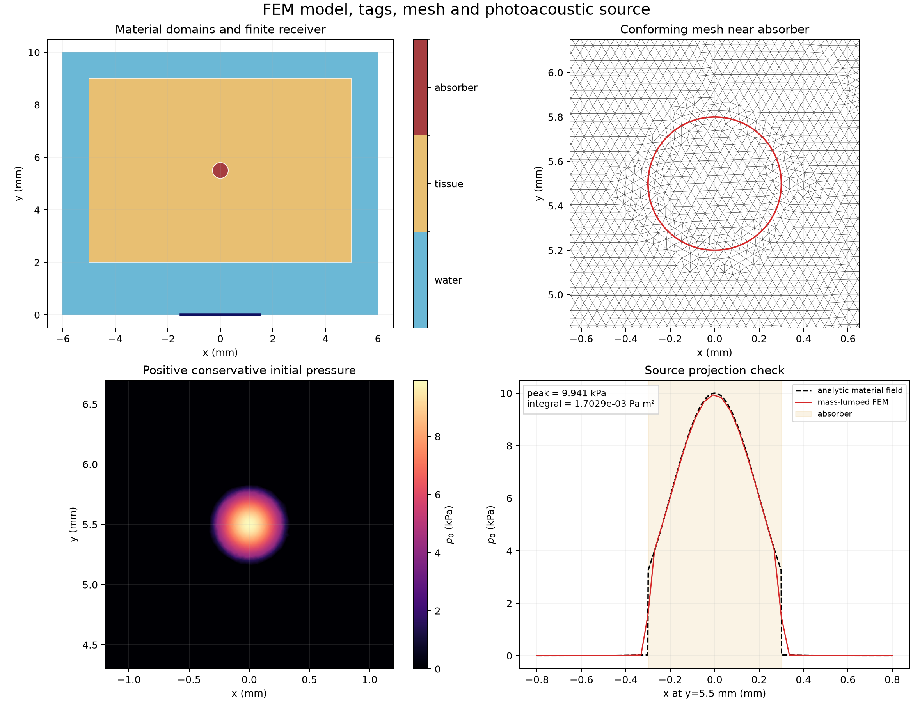
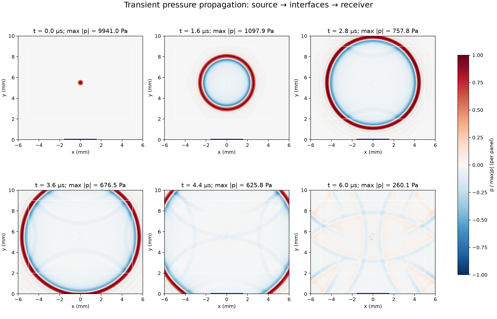
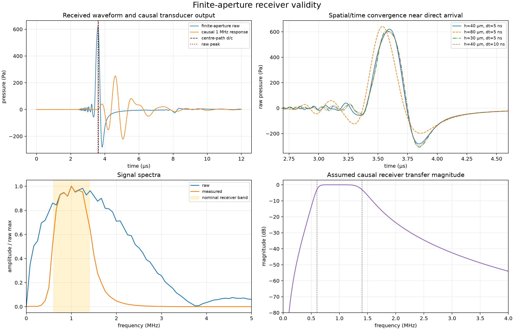
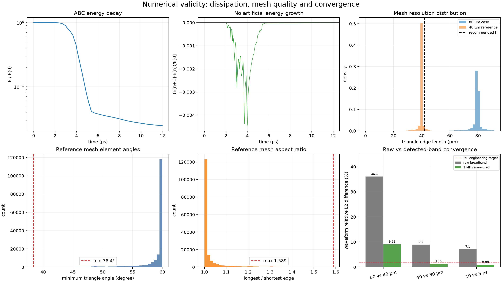

# FEM 前端物理仿真可视化验证报告

## 结论

当前 1 MHz 参考算例完成了“光能沉积—初始声压—异质声传播—有限孔径接收—因果带宽”闭环。参考网格和时间步判据均通过，所有 6 项硬检查通过。

## 主要数值证据

- 参考网格：88,313 自由度，175,523 三角形，95% 边长 41.02 µm。
- 时间离散：5.0 ns，2400 步，CFL 指标 0.305。
- 初压峰值：9.941 kPa；预期量级 10 kPa。
- 探头中心路径理论时延：3.624 µs；原始波形主峰：3.595 µs，相对差 0.80%。
- 有限孔径原始峰值：620.43 Pa；因果带宽后：251.01 Pa。
- 80 vs 40 µm：原始宽带波形 L2 差 36.107%，1 MHz 带限测量差 9.109%；80 µm 网格明显欠解析。
- 40 vs 30 µm：原始宽带波形 L2 差 9.019%，1 MHz 带限测量差 1.350%。
- 时间步 10 vs 5 ns：原始宽带波形 L2 差 7.148%，1 MHz 带限测量差 0.881%。
- 线性检查：passed，残差 0.000e+00。
- ABC 能量非增：True，末态/初态能量 0.0246。

## 图件

1. `01_model_source_mesh.png`：材料标签、相容网格、初压与解析源投影。
2. `02_wave_propagation.png`：六个时刻的声压传播与界面穿越。
3. `03_receiver_and_spectrum.png`：孔径平均波形、到达时间、频谱和探头响应。
4. `04_numerical_validity.png`：能量、网格质量和空间/时间收敛。
5. `05_wave_propagation.gif`：调试网格上的完整瞬态动画。

[打开完整声场传播动画](assets/05_wave_propagation.gif)

## 证据边界

- 独立的平面波小域/大域对照已测得一阶 ABC 人工回波 −55.08 dB，达到 −30 dB 门槛；该结论针对法向入射，不外推到所有斜入射角。
- 首个 5% 阈值越界时间会受有限宽高斯源和数值前驱影响；中心路径的有效性主要由原始主峰时刻检查。
- 当前是二维无损压力声学，代表线源/条形探头；不能将绝对幅值直接解释为三维实验量。
- 1 MHz/80% Butterworth 带宽是明确标注的工程假设，并非论文未报告的真实探头脉冲响应。
- 40 vs 30 µm 时原始宽带波形尚有高频相位差，但实际 1 MHz 带限接收波形差已低于 2% 工程目标；因此当前有效性结论限定于建模的探头检测带宽。
- 本报告只验证前端物理正向算子，不验证编码声学孔径或压缩重建算法。

Stage A/B 的解析波形、封闭域能量、ABC 大域对照、界面反射和孔径收敛，
以及缩小标准域中的 10 MHz 空间/时间收敛，见
[`STRICT_VALIDATION_CN.md`](STRICT_VALIDATION_CN.md)。完整严格验收结果为 5/5 通过。
