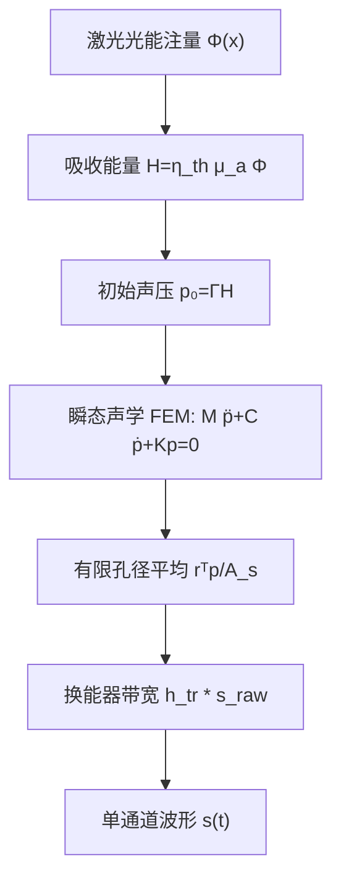

# Python FEM 光声前端物理仿真实现方法

## 1. 目标、边界与结论

本文给出一个可直接指导编码的、独立于论文重建算法的二维光声有限元（finite element method, FEM）前端方案。目标闭环是：



这个闭环只做物理前端，不包含随机光学图案、压缩采样、相关重建或 \(\ell_1\) 优化。它应被视为复现 *Dual-compressed photoacoustic single-pixel imaging* 的第 0 阶段：先建立可信的“能量沉积—声传播—单元接收”正向算子，再逐步接入论文中的光学编码和编码声学孔径。

最重要的范围判断如下。

1. 论文的数值工作不是热弹性—声学 FEM。论文把局部光声信号、空间相关的随机时延、角谱传播和压缩重建串联起来；在大批量 3D 测试中还用反平方传播和 0.1 噪声水平代替了完整角谱计算。[^1]
2. 论文没有给出编码声学孔径的可制造几何、材料参数、频率响应或完整传递函数，只说明实验上需要用水听器逐点标定其二维声场。因此，不能从论文唯一确定一个“原样复刻”的孔径 FEM。[^1]
3. 本文的最小闭环采用标准、可检验的光声初始值问题：在热约束和应力约束成立时，把纳秒激光脉冲等效为初始压力 \(p_0=\Gamma\mu_a\Phi\)，而不是向声波方程持续施加一个机械点载荷。[^2][^3]
4. 所谓二维模型在三维物理上等价于沿纸面外方向无限延伸的线源和条形接收器。二维结果适合检验到达时间、界面反射、数值色散和系统数据流，但绝对幅值、几何扩散及有限面积换能器指向性不能直接与三维实验定量比较。[^4]

## 2. 从论文中能够确认什么

### 2.1 原论文的物理链路

论文提出的链路是：高重复频率脉冲激光经过空间光调制器（SLM/DMD）形成随机照明；局部吸收体产生光声波；编码声学孔径为不同空间位置的声波加入随机传播时延；最后由大孔径单阵元换能器作空间积分。声学测量矩阵 \(T\) 在实验中需要标定：先用电动位移台和水听器扫描编码孔径后方的二维声场，再用角谱法传播到后续平面。[^1]

论文把局部时延写为

\[
t'=t+T_{ij}=g_{ij}t,
\qquad
g=\langle g_{ij}\rangle\approx\frac{g_{\max}+1}{2}.
\]

二维演示使用 \(g=5.5\)，三维演示使用 \(g=25.5\)。论文还报告：水中检测频率为 10 MHz，对应声波长约 148 μm；两个示例对象的像素分别为 200 μm 和 5 μm；三维示例由间隔 10 μm 的 11 个切片构成，报告的压缩比为 21.9。[^1]

这些量属于论文的编码/重建演示参数，不应被误写进组织内的声波偏微分方程。尤其是，论文后文把“无时延调制”称为 \(g=0\)，而前面的定义在 \(T_{ij}=0\) 时应给出 \(g_{ij}=1\)。这是论文符号层面的不一致；实现时必须把“无调制”作为独立布尔状态处理，不能用一个含混的 \(g\) 值驱动物理模型。

### 2.2 论文没有给出的物理量

下列信息无法从论文唯一恢复，因此不能伪装成“论文参数”：

- 组织、水层和吸收体的真实几何尺寸；
- 波长相关的 \(\mu_a,\mu_s',\Gamma\) 以及激光脉宽、脉冲能量、光斑；
- 各区域的密度、声速、频率相关声衰减；
- 单阵元换能器的孔径尺寸、中心频率之外的带宽、脉冲响应、灵敏度和焦距；
- 编码声学孔径的厚度、单元尺寸、材料声阻抗、通道长度、损耗和串扰；
- 10 MHz 信号的实际采样率、信噪比定义及电子噪声谱。

因此，本文后续给出的是“可复现的参考算例”，所有新增数值都明确标为工程基线。它们用于验证代码和建立最小闭环，不用于声称复现论文图像或压缩比。

## 3. 建模层次与最小假设

| 层 | 最小闭环中的物理模型 | 明确不做的内容 | 首个验收量 |
|---|---|---|---|
| 光学 | 规定解析式光能注量（fluence）\(\Phi(\mathbf{x})\) | 光输运蒙特卡洛、散斑、SLM 像素衍射 | \(p_0\) 单位和峰值 |
| 光声转换 | 热/应力约束下的初始压力 \(p_0=\Gamma\eta_{th}\mu_a\Phi\) | 脉冲期间热扩散、非线性热弹性 | 加倍 \(\Phi\) 后波形加倍 |
| 声学 | 异质、线性、无剪切的压力声学 | 骨/固体弹性波、非线性、幂律衰减 | 到达时间与界面反射 |
| 外边界 | 一阶无反射边界（ABC） | 首版不做 PML | 晚时边界回波低于阈值 |
| 换能器 | 有限线孔径压力平均，再卷积带宽响应 | 首版不做压电耦合和电路 | 孔径与时间步收敛 |
| 数值 | P1 三角形 FEM + Newmark 平均加速度法 | 首版不做自适应高阶元 | 网格/时间步收敛 |

组织按流体处理，即只传播纵向压力波。对于软组织和水耦合层，这是合理的第一版；若模型包含骨、固态声学编码板或显著剪切效应，应改为弹性动力学并处理流固耦合，不能继续使用本文的标量压力方程。

## 4. 光学能量如何变成声学初值

### 4.1 一般光声源方程

在均匀、线性介质中，常见光声波动方程可写为

\[
\nabla^2p-\frac{1}{c^2}\frac{\partial^2p}{\partial t^2}
=-\frac{\beta_T}{C_p}\frac{\partial H}{\partial t},
\]

其中 \(\beta_T\) 是体膨胀系数，\(C_p\) 是定压比热容，\(H(\mathbf{x},t)\) 是单位体积、单位时间的热沉积率。若激光脉宽 \(\tau_L\) 同时远小于

\[
\tau_s\sim \frac{L}{c},
\qquad
\tau_{th}\sim\frac{L^2}{4\alpha_{th}},
\]

即满足应力约束和热约束，脉冲结束后的传播可等效为初始值问题：[^2][^3]

\[
p(\mathbf{x},0)=p_0(\mathbf{x})=\Gamma(\mathbf{x})H_0(\mathbf{x}),
\qquad
\frac{\partial p}{\partial t}(\mathbf{x},0)=0,
\]

\[
H_0(\mathbf{x})=\eta_{th}(\mathbf{x})\mu_a(\mathbf{x})\Phi(\mathbf{x}).
\]

这里 \(\Phi\) 是光能注量，单位为 J/m²；\(\mu_a\) 是 m⁻¹，因此 \(H_0\) 是 J/m³，也就是 Pa；Grüneisen 参数 \(\Gamma\) 和热转化效率 \(\eta_{th}\) 无量纲。若使用的 \(H_0\) 数据已经代表“吸收并转化为热的能量密度”，则不要再次乘 \(\eta_{th}\)。

代码应把脉宽约束做成启动检查，例如要求 \(\tau_L<0.1\min(\tau_s,\tau_{th})\) 才启用初始压力近似。以 \(L=0.20\) mm、\(c=1540\) m/s 估算，\(\tau_s\approx130\) ns；10 ns 脉冲满足这个保守检查，而 100 ns 脉冲已接近边界。论文附件只写了脉冲激光，没有给出脉宽，因此实际复现必须从激光器规格补齐 \(\tau_L\)。不满足约束时，应回到含 \(\partial_tH\) 的时间源方程。

### 4.2 “激光点源”必须正则化

FEM 中不要把激光点源实现为一个节点上的 Dirac 载荷。Dirac 初值包含无限高空间频率，峰值随网格改变，并会强烈激发数值色散。最小闭环应使用有限宽度高斯光斑：

\[
\Phi(\mathbf{x})=\Phi_{pk}
\exp\left[-\frac{\|\mathbf{x}-\mathbf{x}_s\|^2}{2\sigma_s^2}\right].
\]

随后按材料场计算 \(p_0=\Gamma\eta_{th}\mu_a\Phi\)。如果首个验证只关心声学，可直接规定一个高斯 \(p_0\)，但代码和输出元数据必须明确这是“规定初始压力”，而不是已经求解了光输运。

高斯源的半高全宽为

\[
\mathrm{FWHM}=2\sqrt{2\ln2}\,\sigma_s\approx2.355\sigma_s.
\]

可把幅谱下降到约 1% 的波数 \(k\approx3/\sigma_s\) 作为保守上限，于是

\[
f_{\max,src}\approx\frac{3c}{2\pi\sigma_s}.
\]

这个 \(f_{\max}\) 用于选网格和时间步，比只盯换能器中心频率更可靠。尖锐的二值吸收边界同样包含很高空间频率；首版可用高斯吸收体，或对二值边界做一个小于成像尺度、但能被网格解析的平滑过渡。k-Wave 的数值示例也明确展示了初始压力平滑对高频伪影和主瓣宽度的折衷。[^5]

### 4.3 为什么首版不求光扩散方程

本文的目标是验证声学 FEM 闭环，因此 \(\Phi\) 先作为输入场。以后若要处理强散射组织，可增加稳态扩散近似

\[
-\nabla\cdot[D(\mathbf{x})\nabla\Phi]
+\mu_a(\mathbf{x})\Phi=q(\mathbf{x}),
\qquad
D=\frac{1}{3(\mu_a+\mu_s')},
\]

并把结果投影到声学网格。扩散近似在准直点源、边界附近和低散射区并不总可靠；需要真实散斑或浅层精细光输运时，应改用蒙特卡洛。[^6] 这属于升级项，不应阻塞首个声学闭环。

## 5. 异质压力声学模型

### 5.1 强形式

对静止、无黏、各向同性、流体样介质，采用守恒形式

\[
\frac{1}{K(\mathbf{x})}\frac{\partial^2p}{\partial t^2}
-\nabla\cdot\left[
\frac{1}{\rho(\mathbf{x})}\nabla p
\right]=0,
\qquad
K=\rho c^2.
\]

这种写法比直接用 \(c^{-2}p_{tt}-\nabla^2p=0\) 更适合跨材料界面。有限元弱式自然给出：

- 压力 \(p\) 连续；
- 法向速度对应的通量 \(\rho^{-1}\partial_n p\) 连续。

当吸收体只提供光学对比而声学性质与周围组织相同，仍保留单独的 `absorber` 物理区域以构造 \(p_0\)，但在声学矩阵中赋予与 `tissue` 相同的 \(\rho,c\)。这样可以把光学对比和声学对比分开验证。

### 5.2 一阶吸收边界

外边界采用局部一阶 Sommerfeld/Engquist–Majda 型条件：[^7]

\[
\frac{\partial p}{\partial n}+\frac{1}{c_b}\frac{\partial p}{\partial t}=0
\quad\text{on }\Gamma_{abs}.
\]

用测试函数 \(q\) 积分后得到

\[
\int_\Omega\frac{1}{K}q\,\ddot p\,d\Omega
+\int_\Omega\frac{1}{\rho}\nabla q\cdot\nabla p\,d\Omega
+\int_{\Gamma_{abs}}\frac{1}{\rho_b c_b}q\,\dot p\,d\Gamma=0.
\]

若整个外边界都位于水缓冲层，\(\rho_b,c_b\) 可统一取水参数，这是推荐的最简几何。若组织直接接触外边界，必须按相邻材料拆分边界标签并分别装配，不能在所有边界上误用同一个声阻抗。

一阶 ABC 对近法向入射较好，对斜入射和掠射只是近似。它适合最小闭环，但必须通过“大域参考解”量化残余回波。最终高精度模型可换成 PML；PML 需要单独做厚度和吸收强度收敛，且源和传感器不应放在 PML 内。[^8]

### 5.3 半离散系统

用一阶 Lagrange 三角形（P1）近似

\[
p_h(\mathbf{x},t)=\sum_jN_j(\mathbf{x})p_j(t),
\]

得到

\[
\mathbf M\ddot{\mathbf p}
+\mathbf C\dot{\mathbf p}
+\mathbf K\mathbf p=\mathbf f(t),
\]

其中

\[
M_{ij}=\int_\Omega\frac{1}{K}N_iN_j\,d\Omega,
\]

\[
K_{ij}=\int_\Omega\frac{1}{\rho}\nabla N_i\cdot\nabla N_j\,d\Omega,
\]

\[
C_{ij}=\int_{\Gamma_{abs}}\frac{1}{\rho_b c_b}N_iN_j\,d\Gamma.
\]

满足脉冲约束后，传播阶段 \(\mathbf f=0\)，初值为

\[
\mathbf p(0)=\mathbf p_0,
\qquad
\dot{\mathbf p}(0)=0.
\]

初始加速度要由离散方程一致地求得：

\[
\mathbf M\mathbf a_0
=\mathbf f_0-\mathbf C\mathbf v_0-\mathbf K\mathbf p_0.
\]

不要把 \(p_0\) 同时作为初值和时间载荷，否则会把同一激光脉冲计算两次。

## 6. 换能器不是一个节点

### 6.1 有限孔径接收算子

二维模型中的单阵元换能器是一段边界 \(\Gamma_s\)。原始声压信号定义为空间加权平均：

\[
s_{raw}(t)=
\frac{\int_{\Gamma_s}w(s)p(s,t)\,d\Gamma}
{\int_{\Gamma_s}w(s)\,d\Gamma}
=\frac{\mathbf r^T\mathbf p(t)}{A_s},
\]

\[
r_i=\int_{\Gamma_s}w(s)N_i(s)\,d\Gamma,
\qquad
A_s=\int_{\Gamma_s}w(s)\,d\Gamma.
\]

首版取 \(w=1\)。`scikit-fem` 中应通过 `FacetBasis` 对 `sensor` 边界装配 \(\mathbf r\)，而不是从几何中心附近挑一个节点。这样才能表现有限孔径的空间平均和相消。

建议同时把 `sensor` 边界纳入 ABC。此时它表示一个声阻抗匹配、非侵入式的接收面：压力被读取，但不人为反射声波。若以后要模拟换能器表面的阻抗失配，应单独加入阻抗边界或压电耦合，不能既当完全匹配 ABC 又声称模拟了真实探头反射。

### 6.2 带宽和脉冲响应

测量波形为

\[
s_{meas}(t)=h_{tr}(t)*s_{raw}(t)+n(t),
\]

其中 \(h_{tr}\) 是声学—电学总脉冲响应。论文只确认 10 MHz 检测频率，没有给出带宽或实测脉冲响应；因此 10 MHz 只能作为中心频率，不能据此虚构一个“论文换能器”。

实现时优先读取实测 \(h_{tr}\)。没有实测数据时，可用中心频率 \(f_c\) 和分数带宽 \(B/f_c\) 构造一个可重复的带通模型。k-Wave 也使用中心频率与 FWHM 百分比定义高斯频响。[^9] 若到达时间是验收指标，应使用因果 FIR/IIR 或明确补偿群延迟；`sosfiltfilt` 一类零相位滤波只能用于离线频谱/包络比较，不能当作真实因果接收链。

噪声在最小闭环验收通过后再加入。推荐分别建模：

- 电子白噪声或带限噪声；
- 脉冲间激光能量抖动；
- 声学背景散射；
- 量化噪声。

不要沿用论文“0.1 噪声水平”而不定义它相对于峰值、均方根还是功率。

## 7. 参考算例：一套能跑通但不冒充论文参数的基线

### 7.1 几何和材料

外域用水包围组织，使所有外边界都接触水，简化 ABC：

| 项目 | 参考值 | 性质 |
|---|---:|---|
| 计算域 | \(x\in[-6,6]\) mm，\(y\in[0,10]\) mm | 工程基线 |
| 组织块 | \(x\in[-5,5]\) mm，\(y\in[2,9]\) mm | 工程基线 |
| 吸收体 | 圆心 \((0,5.5)\) mm，半径 0.30 mm | 工程基线 |
| 传感器 | 顶边 \(y=0\)，\(x\in[-1.5,1.5]\) mm | 工程基线 |
| 水 | \(\rho=1000\) kg/m³，\(c=1480\) m/s | 常用参考值 |
| 软组织 | \(\rho=1050\) kg/m³，\(c=1540\) m/s | 常用参考值 |
| 吸收体声学性质 | 首版与软组织相同 | 隔离光学对比 |
| Grüneisen 参数 | \(\Gamma=0.10\) | 工程基线 |
| 热转化效率 | \(\eta_{th}=1\) | 工程基线 |
| 吸收体 \(\mu_a\) | 1000 m⁻¹ | 工程基线 |
| 背景 \(\mu_a\) | 10 m⁻¹ | 工程基线 |
| 峰值光能注量 \(\Phi_{pk}\) | 100 J/m²，即 10 mJ/cm² | 工程基线 |
| 高斯宽度 \(\sigma_s\) | 0.20 mm | 工程基线 |
| 仿真终止时间 | 12 μs | 工程基线 |

按上述峰值，吸收体中心的量级为

\[
p_{0,pk}\approx0.1\times1000\times100=10\ \mathrm{kPa}.
\]

这只是自洽的量纲示例。换波长、吸收体或激光安全条件后，\(\mu_a,\Phi,\Gamma\) 必须一起更新。

### 7.2 两个换能器配置

| 配置 | 中心频率 | 分数带宽（FWHM） | 用途 |
|---|---:|---:|---|
| `baseline_1MHz` | 1 MHz | 80%（假设） | 普通工作站上的闭环调试 |
| `paper_linked_10MHz` | 10 MHz | 未知；必须扫描或实测 | 与论文频率建立联系，不宣称同一探头 |

先完成 1 MHz 基线。直接从 10 MHz 起步会把网格和时间步成本提高一个数量级，还会让几何、边界和探头错误被高频数值色散掩盖。

## 8. 网格和时间步如何选

### 8.1 空间分辨率

P1 三角形的经验起点是每个最短有效波长至少 10 个单元：

\[
h\le \frac{\lambda_{min}}{10}
=\frac{c_{min}}{10f_{max}}.
\]

这里

\[
f_{max}=\max(f_{max,src}, f_{max,tr}),
\]

而不是简单取 \(f_c\)。以 \(\sigma_s=0.20\) mm 估算，\(f_{max,src}\approx3.5\) MHz，水中 \(\lambda_{min}\approx0.42\) mm，故参考网格可取 \(h=40\) μm。此时高斯 FWHM 约 0.47 mm，跨越约 12 个单元，3 mm 传感器跨越约 75 个边界小段。

建议提供两个网格配置：

- `debug`：\(h\approx0.10\) mm，仅检查标签、矩阵、到达时间和 I/O；
- `reference`：源和主要传播区 \(h\approx0.04\) mm，用于收敛结果。

局部加密不能产生极小的劣质三角形，否则会抬高时间分辨要求并恶化矩阵条件数。至少输出最小/最大边长、最小角度、长宽比和每个物理组的单元数。

对论文关联的 10 MHz：水中中心波长是 148 μm。只解析中心频率时，P1 网格已经需要约 15 μm；若探头带宽延伸到 15 MHz，需约 10 μm 或更细。论文的 5 μm 光学像素若要作为显式二值 \(p_0\) 几何解析，声学网格甚至要到 1–2 μm 量级。这说明“5 μm 光学编码”与“10 MHz 声场 FEM”不能被粗暴地等同为同一网格分辨率；可用细光学场到粗声学空间的守恒投影，但粗网格不会保留不可传播/不可检测的高空间频率。

### 8.2 时间步

Newmark 平均加速度法对线性系统无条件稳定，但稳定不等于相位准确。时间步应同时满足

\[
\Delta t\lesssim\frac{1}{20\text{--}30\,f_{max}},
\qquad
\frac{c_{max}\Delta t}{h_{min}}\lesssim0.3\text{--}0.4
\]

作为初始精度准则，并最终用减半测试确认。参考网格 \(h\approx40\) μm 可从 \(\Delta t=10\) ns 开始；12 μs 对应 1200 步。若局部存在小于 40 μm 的单元，第二个条件应使用真实的 \(h_{min}\) 重算。

论文关联的 10 MHz 宽带算例通常需要 2–4 ns 甚至更小的时间步。若传播距离真如论文讨论所说达到数十厘米，普通低阶隐式 FEM 会非常昂贵；此时应考虑高阶/显式方法、域分解、GPU 或 k-space 方法，而不是把最小闭环参数直接等比例放大。

## 9. Gmsh：几何、相容界面和物理标签

Gmsh 负责几何和网格，`meshio` 负责格式检查/转换，`scikit-fem` 负责装配和时间推进。Gmsh 的 Physical Groups 是跨工具传递材料区和边界语义的唯一可靠接口；默认情况下，定义了物理组后，未加入物理组的单元可能不会被写出。[^10]

### 9.1 推荐标签

| 维数 | 名称 | 数字 ID | 用途 |
|---:|---|---:|---|
| 2 | `water` | 101 | 水域声学矩阵 |
| 2 | `tissue` | 102 | 组织声学矩阵 |
| 2 | `absorber` | 103 | 初始压力和组织声学矩阵 |
| 1 | `sensor` | 201 | 接收积分，同时加入 ABC |
| 1 | `outer_absorbing` | 202 | 其余外边界 ABC |

Gmsh 官方只要求标签在同一几何维数内唯一，但实际用 meshio 5.3.5 和 scikit-fem 12.0.2 做 MSH 往返测试时，跨维度复用数字 ID 会导致名称匹配存在歧义。为稳妥起见，本文要求所有维度的 Physical ID 全局唯一。

### 9.2 几何生成规则

1. 用 OpenCASCADE 内核创建外部水域、组织块和吸收体圆。
2. 对重叠曲面执行 `occ.fragment`，保证水—组织—吸收体界面节点相容。不要生成彼此覆盖、各自独立的三套三角网格。
3. 顶边在传感器两端显式分段，使 `sensor` 是独立曲线，而不是靠坐标容差从一条长边中“猜”出一段。
4. 用 `fragment` 返回映射、质心或包围盒重新识别曲面；布尔运算后不要继续沿用旧实体 tag。
5. 给每个二维单元且只给一个材料标签；给整个外边界恰好一个边界用途标签。`sensor` 与 `outer_absorbing` 在几何上不重叠。
6. 设置局部网格尺寸场：源区、材料界面和传感器边缘较细，远离源的水缓冲区可缓慢变粗；相邻尺寸增长率要受限。
7. 首选写出 MSH 4.1，同时保留生成网格时的 Gmsh 版本和参数文件。

最小 API 顺序应保持清楚；实体识别和边界分段是实现主体，不能用下面的骨架替代：

```python
gmsh.initialize()
gmsh.model.add("pa2d")
occ = gmsh.model.occ

# 用显式分段的外轮廓创建水域；再创建 tissue 和 absorber。
# 对重叠曲面执行 fragment，并用返回映射/质心重建实体列表。
out_dimtags, out_map = occ.fragment(object_dimtags, tool_dimtags)
occ.synchronize()

gmsh.model.addPhysicalGroup(2, water_tags, 101)
gmsh.model.setPhysicalName(2, 101, "water")
# tissue=102, absorber=103, sensor=201, outer_absorbing=202

# 设置背景/距离/阈值等 Mesh Size Field 后生成二维网格。
gmsh.model.mesh.generate(2)
gmsh.option.setNumber("Mesh.MshFileVersion", 4.1)
gmsh.write("domain.msh")
gmsh.finalize()
```

当前 Gmsh 提供 Python API 和无图形依赖的 Linux 构建；在无桌面的 CI/容器中若 `import gmsh` 报 X11/字体库缺失，应使用官方 no-X 构建或补齐系统运行库，不要因此改用手写非相容网格。[^11]

## 10. meshio：导入前的强制审计

`meshio` 支持 Gmsh 2.2/4.x、VTK、XDMF 等格式，并保留 `gmsh:physical` 单元数据。[^12] 首版不需要为了“流程完整”强制转 XDMF；`MeshTri.load` 本身可经 meshio 读取 `.msh`。只有并行 I/O、超大时间序列或外部后处理需要时再转 XDMF。

导入检查应作为独立命令运行并在失败时立即退出：

```python
m = meshio.read("domain.msh")

tri = m.cells_dict["triangle"]
line = m.cells_dict["line"]
tri_tag = m.cell_data_dict["gmsh:physical"]["triangle"]
line_tag = m.cell_data_dict["gmsh:physical"]["line"]
field = m.field_data
```

必须断言：

- `water`、`tissue`、`absorber`、`sensor`、`outer_absorbing` 全部存在且非空；
- 三角形物理标签只出现 101、102、103；每个三角形只属于一个声学材料；
- 线单元物理标签只出现 201、202；
- `sensor` 计算长度与 3 mm 的设计值在网格容差内一致；
- 所有三角形面积为正，节点索引无悬空；
- 材料界面处共享节点，而不是位置相同但拓扑断开；
- 网格使用米作为进入求解器后的统一单位。若 Gmsh 脚本用毫米，导出/读取后必须明确乘 \(10^{-3}\)，并写入元数据。

本方案已用 meshio 5.3.5 → scikit-fem 12.0.2 做过一个带二维材料组和一维 `sensor`/`absorbing` 组的最小往返装配检查；`FacetBasis` 能正确恢复边界长度并装配接收向量。这个测试只确认 API 和标签数据流，不替代真实几何的网格质量与物理解验证。

## 11. scikit-fem 装配设计

`scikit-fem` 是轻量 Python FEM 装配库，支持三角网格、边界 `FacetBasis`、命名子域以及通过 meshio 读取外部网格。[^13] 推荐锁定并记录环境，例如 Python 3.10+、Gmsh 4.15.x、meshio 5.3.5、scikit-fem 12.0.2、NumPy/SciPy 的确切版本。依赖应固定在 `requirements.lock` 或等价文件中，避免 API 漂移。

### 11.1 建议的代码分层

```text
pa_fem/
├── config.py            # SI 参数、配置校验、随机种子
├── geometry.py          # Gmsh 几何、fragment、Physical Groups
├── mesh_check.py        # meshio 标签、单位、质量、长度审计
├── materials.py         # rho、c、K、Gamma、mu_a
├── source.py            # Phi、H0、p0 与投影
├── assemble.py          # M、C、K、接收向量 r
├── time_integrator.py   # Newmark 和稀疏分解
├── receiver.py          # 孔径平均、脉冲响应、采样和噪声
├── validation.py        # 解析量、能量、收敛、回波测试
└── run_case.py          # 单个算例编排，不放物理公式
```

材料、源、求解器和接收器配置要能独立替换。不要在装配函数里用 `if x[1] > ...` 这类坐标阈值硬编码材料；材料归属来自 Gmsh 标签。

### 11.2 双线性形式骨架

```python
from skfem import BilinearForm
from skfem.helpers import dot, grad

@BilinearForm
def mass(u, v, w):
    return w.inv_bulk * u * v

@BilinearForm
def stiffness(u, v, w):
    return w.inv_rho * dot(grad(u), grad(v))

@BilinearForm
def abc(u, v, w):
    return w.inv_rho_c * u * v
```

对每个材料标签建立受限 `Basis`，分别装配并相加：

```python
element = ElementTriP1()
basis = Basis(mesh, element)

M = 0
K = 0
for name, mat in materials.items():
    bmat = Basis(mesh, element, elements=name)
    M += asm(mass, bmat, inv_bulk=1.0 / (mat.rho * mat.c**2))
    K += asm(stiffness, bmat, inv_rho=1.0 / mat.rho)

fb_abs = FacetBasis(
    mesh, element, facets={"outer_absorbing", "sensor"}
)
C = asm(abc, fb_abs, inv_rho_c=1.0 / (rho_water * c_water))
```

这里的代码是接口骨架，不是完整工程。实现时要把零矩阵初始化为正确尺寸和稀疏格式，并断言 \(M,K,C\) 对称，\(M,K\) 的对角线为正，\(C\) 半正定。

如果材料系数在一个物理区内连续变化，可在积分点传入数组；但首版分片常数更容易审计。不要先把节点处材料值做简单平均再装配，这会模糊界面声阻抗。

### 11.3 初始压力的有限元投影

首选 \(L^2\) 投影：求 \(\mathbf p_0\) 使

\[
\int_\Omega N_i p_{0,h}\,d\Omega
=\int_\Omega N_i p_0^{analytic}\,d\Omega.
\]

`Basis.project` 可用于这一步。节点插值对平滑高斯通常也能工作，但在材料界面和细光学图案处不守恒。至少保存并比较：解析 \(\int p_0\,d\Omega\)、投影后的离散积分、峰值位置和半高全宽。

## 12. Newmark 时间推进

使用平均加速度参数

\[
\beta=\frac14,\qquad\gamma=\frac12.
\]

对每个时间步，预测量为

\[
\mathbf p_{pred}=\mathbf p_n+\Delta t\,\mathbf v_n
+\Delta t^2\left(\frac12-\beta\right)\mathbf a_n,
\]

\[
\mathbf v_{pred}=\mathbf v_n
+\Delta t(1-\gamma)\mathbf a_n.
\]

求解

\[
(\mathbf M+\gamma\Delta t\mathbf C
+\beta\Delta t^2\mathbf K)\mathbf a_{n+1}
=\mathbf f_{n+1}-\mathbf C\mathbf v_{pred}
-\mathbf K\mathbf p_{pred},
\]

再更新

\[
\mathbf p_{n+1}=\mathbf p_{pred}+\beta\Delta t^2\mathbf a_{n+1},
\]

\[
\mathbf v_{n+1}=\mathbf v_{pred}+\gamma\Delta t\mathbf a_{n+1}.
\]

因 \(\Delta t,M,C,K\) 固定，有效矩阵只分解一次。SciPy 的 `factorized` 对 CSC 矩阵返回可重复调用的稀疏求解函数。[^14]

```python
Aeff = (M + gamma*dt*C + beta*dt**2*K).tocsc()
solve_eff = scipy.sparse.linalg.factorized(Aeff)

# 一致初始加速度
a = scipy.sparse.linalg.spsolve(
    M.tocsc(), f0 - C @ v - K @ p
)

for n in range(nt - 1):
    p_pred = p + dt*v + dt**2*(0.5 - beta)*a
    v_pred = v + dt*(1.0 - gamma)*a
    rhs = f_next - C @ v_pred - K @ p_pred
    a_new = solve_eff(rhs)
    p = p_pred + beta*dt**2*a_new
    v = v_pred + gamma*dt*a_new
    a = a_new
```

每步只保存接收波形和少量选定场快照，避免把全部自由度 × 全部时间步写入内存。建议数据产品为：

- `metadata.json`：所有 SI 参数、软件版本、网格哈希；
- `mesh.msh`：带 Physical Groups 的原始网格；
- `waveform.npz`：`time_s`、`s_raw_pa`、`s_meas`；
- `snapshots.vtu` 或按时刻拆分的 VTU：用于可视化；
- `validation.json`：每项验收指标和通过/失败状态。

## 13. 换能器向量与后处理的实现顺序

1. 用 `FacetBasis(mesh, element, facets="sensor")` 装配单位权重的边界线性泛函，得到 \(\mathbf r\)。
2. 由同一积分计算 \(A_s=\sum_i r_i\)，并断言它等于设计孔径长度。
3. 每个时间步只计算 \(s_{raw}=\mathbf r^T\mathbf p/A_s\)。
4. 求解结束后，按目标 ADC 采样率重采样；原始 FEM 采样率不能低于目标频带的数值需求。
5. 用实测或假设的因果 \(h_{tr}\) 卷积，保存滤波前后两条波形。
6. 最后才加噪声，并记录随机种子、噪声 RMS、带宽和 SNR 定义。

如果为了调试还需要点探头，可另装配一个空间平滑的小圆/小线接收器，不要依赖“最近节点”。有限孔径、点接收器和中心节点波形应分别命名，避免在图中混用。

## 14. 验证矩阵：通过这些测试才算闭环

### 14.1 数学与数值测试

| 测试 | 做法 | 建议通过标准 |
|---|---|---|
| 标签完整性 | 统计每个 2D/1D Physical Group | 所有必需组非空；无未分类三角形 |
| 传感器长度 | \(A_s=\sum_i r_i\) | 相对几何设计误差 < 0.5% |
| 矩阵性质 | 检查对称误差、对角线、特征值抽样 | 对称误差接近机器精度；无非物理负质量 |
| 到达时间 | 均匀水域，比较峰前沿与 \(d/c\) | 相对误差 < 1–2% |
| 线性 | 把 \(p_0\) 加倍 | 整条波形加倍，归一化残差接近机器误差 |
| 能量 | 关闭 ABC，计算 \(E=\tfrac12v^TMv+\tfrac12p^TKp\) | 误差随 \(\Delta t\) 收敛且无系统增长 |
| ABC 耗散 | 开启 ABC | \(\dot E=-v^TCv\le0\)，无能量自发增长 |
| 网格收敛 | \(h,h/2\) 对比传感器波形 | 归一化 \(L^2\) 差 < 2% |
| 时间收敛 | \(\Delta t,\Delta t/2\) 对比 | \(L^2\) 差 < 1%，到达时刻差 < 0.5% |
| 孔径收敛 | 细化传感器边界单元 | 峰值和主频变化 < 1% |

阈值是工程建议，不是物理定律；最终应按目标用途收紧。

### 14.2 物理解测试

**均匀介质传播。** 在同半径上放置多个虚拟接收点，检查波前近似圆对称。二维点源实际对应三维线源，远场压力幅度约按 \(r^{-1/2}\) 衰减，而不是三维点源的 \(r^{-1}\)。二维脉冲还具有三维点源没有的长尾。[^4]

**平面界面反射。** 让近似平面波正入射水—组织界面，比较压力反射系数

\[
R_p=\frac{Z_2-Z_1}{Z_2+Z_1},
\qquad Z_i=\rho_i c_i.
\]

先用明显的阻抗差检查符号和幅值，再回到真实软组织参数。

**边界反射。** 与一个边界距离加倍的大域解比较，在首个物理回波之后测量人工晚时回波。建议人工回波峰值低于主峰 −30 dB；达不到时，增大水缓冲层或升级 PML。

**外部交叉验证。** 在一个均匀、高斯 \(p_0\) 的简单算例上，与解析 Green 函数或 k-Wave 结果比较到达时间、频谱和二维尾波。交叉验证不会破坏实现独立性，反而能区分 FEM 错误和物理预期。

## 15. 建议的实施顺序

### 阶段 A：验证数值骨架

1. 均匀水域、解析高斯 \(p_0\)、大域无 ABC；
2. 一个小的有限孔径传感器；
3. Newmark 能量和 \(d/c\) 测试；
4. 加入 ABC，并与大域解比较。

完成条件：标签、能量、到达时间、网格和时间步收敛全部通过。

### 阶段 B：用户要求的最小物理闭环

1. 加入水—组织相容界面；
2. 把吸收体保持为纯光学对比；
3. 从 \(\Phi,\mu_a,\Gamma\) 计算并投影 \(p_0\)；
4. 有限孔径平均；
5. 加入一个明确标为假设的 1 MHz 因果带宽响应；
6. 输出场快照、原始/滤波波形和验证报告。

完成条件：本文第 14 节全部适用测试通过。这时才可以说“二维组织 + 激光点源 + 瞬态声波 + 换能器接收”的物理前端闭环成立。

### 阶段 C：向论文物理层靠近

1. 用一组 SLM/DMD 光学图案生成多组 \(\Phi_m\) 和 \(p_{0,m}\)，但仍只输出物理波形，不做重建；
2. 把中心频率提高到 10 MHz，并独立完成网格/时间步/探头带宽收敛；
3. 取得或设计编码孔径的真实几何和材料；
4. 仿真每个通道的脉冲响应，并像论文所述那样形成可标定的传递矩阵 \(T\)；
5. 最后才把物理正向数据交给论文的压缩采样/重建层。

理想时延算子可作为对照，但不是物理孔径 FEM：

\[
C'_{ij}(t)=C_{ij}(t-T_{ij})
\]

只改变时间索引，不会自动产生真实通道中的色散、反射、损耗和串扰。若设计延迟线，可用

\[
\Delta L_j\approx c\,T_j
\]

估算额外水路长度，或用不同声速材料近似

\[
T_j=L\left(\frac1{c_j}-\frac1{c_{ref}}\right),
\]

但最终必须用全波仿真/水听器标定其复数传递函数。论文列举了延迟线、非均匀微结构、卷曲空间/变换声学、谐振结构和遍历声学中继等可能途径，却没有给出可直接复刻的具体设计。[^1]

## 16. 后续物理升级的优先级

### 16.1 频率相关声衰减

软组织常用

\[
\alpha(f)=\alpha_0|f|^y,
\qquad 1\lesssim y\lesssim2
\]

描述频率幂律衰减；因果模型还伴随色散。[^15] 一个任意常数 \(\mathbf C=a\mathbf M+b\mathbf K\) 的 Rayleigh 阻尼通常不能等价代表软组织幂律吸收。最小闭环先做无损组织并明确局限；下一版可引入标准线性固体的多松弛机制、分数阶模型或用已验证的 k-Wave 作参照。

### 16.2 三维模型

若目标是实验幅值、几何扩散、大面积圆形探头指向性或编码孔径像素串扰，三维不是可选项。二维结果只用于开发和物理单元测试。一个务实路线是：二维调通 → 小型三维均匀域 → 三维组织/探头 → 编码孔径局部模型，而不是一次性复制完整系统。

### 16.3 真实探头

按复杂度递增：

1. 有限孔径压力平均 + 实测 \(h_{tr}\)；
2. 频率相关表面阻抗；
3. 匹配层和背衬的声学域；
4. 压电本构 + 电路负载。

对论文的单像素物理前端，步骤 1 通常已经比“读一个节点”可信得多，也是最值得先完成的层次。

## 17. 常见失败方式

- **把激光写成声学节点力。** 这会混淆能量沉积和机械激励；脉冲约束下应使用 \(p_0\)。
- **在同一个求解中既设置 \(p_0\) 又加同一脉冲源项。** 能量被重复注入。
- **把二维幅值当三维实验幅值。** 二维是线源/条形探头，几何扩散不同。
- **只按换能器中心频率定网格。** 源和带宽上沿可能包含更高频率。
- **Newmark 无条件稳定就任意增大时间步。** 波形相位和频谱仍会错误。
- **从最近节点读取“换能器”。** 失去孔径平均，网格一变波形就变。
- **Gmsh 布尔运算后继续使用旧实体 tag。** 物理组会指向错误实体或为空。
- **跨维度复用 Physical ID。** meshio/scikit-fem 的名称恢复可能产生歧义。
- **材料靠坐标判断。** 曲面布尔分割、边界误差和后续几何变化会破坏装配。
- **把一阶 ABC 当完美无反射边界。** 斜入射会残留反射，必须验收。
- **用一个常数阻尼冒充组织幂律衰减。** 会得到错误的频率依赖和相位。
- **把论文的随机 \(g\) 直接乘在组织传播时间上。** 编码时延属于孔径/传递算子，不属于组织 PDE。
- **直接宣称复现论文亚波长分辨率。** 本文只产生正向波形；亚波长成像主张还依赖光学编码、孔径标定和重建统计。

## 18. 最终判定标准

这份实现方法对应的最小闭环只有在以下条件同时成立时才完成：

- Gmsh 网格的材料和边界标签通过自动审计；
- \(p_0\) 由有单位的 \(\Phi,\mu_a,\Gamma\) 生成，或被明确标为规定初值；
- 异质压力方程以 \(1/K\) 和 \(1/\rho\) 的守恒弱式装配；
- 外边界反射经大域对比量化；
- 接收器使用有限孔径积分，带宽模型和因果性有记录；
- 到达时间、线性、能量、界面反射、空间/时间/孔径收敛全部通过；
- 输出中完整记录 SI 参数、版本、网格哈希、时间步和验证指标；
- 对二维、无损软组织、非压电探头及未建模编码孔径的局限作清晰声明。

达到这些条件后，输出波形 \(s(t)\) 才能作为后续编码孔径或压缩重建层的可信输入。它不是论文算法的替代品，而是论文原数值链路所缺少的、可独立验证的物理前端。

## Sources

1. Y. Guo, B. Li, and X. Yin, “Dual-compressed photoacoustic single-pixel imaging,” *National Science Review*, nwac058. [DOI](https://doi.org/10.1093/nsr/nwac058)
2. L. V. Wang and J. Yao, “A practical guide to photoacoustic tomography in the life sciences,” *Nature Methods* 13, 627–638 (2016). [DOI](https://doi.org/10.1038/nmeth.3925)
3. P. Beard, “Biomedical photoacoustic imaging,” *Interface Focus* 1, 602–631 (2011). [DOI](https://doi.org/10.1098/rsfs.2011.0028)
4. k-Wave documentation, “Photoacoustic Waveforms in 1D, 2D and 3D.” [Documentation](https://www.k-wave.org/documentation/example_ivp_photoacoustic_waveforms.php)
5. k-Wave documentation, “Source Smoothing.” [Documentation](https://www.k-wave.org/documentation/example_na_source_smoothing.php)
6. S. L. Jacques, “Optical properties of biological tissues: a review,” *Physics in Medicine & Biology* 58, R37–R61 (2013). [DOI](https://doi.org/10.1088/0031-9155/58/11/R37)
7. B. Engquist and A. Majda, “Absorbing boundary conditions for the numerical simulation of waves,” *Mathematics of Computation* 31, 629–651 (1977). [DOI](https://doi.org/10.1090/S0025-5718-1977-0436612-4)
8. k-Wave documentation, “Controlling the Absorbing Boundary Layer.” [Documentation](https://www.k-wave.org/documentation/example_na_controlling_the_pml.php)
9. k-Wave documentation, “Defining A Gaussian Sensor Frequency Response.” [Documentation](https://www.k-wave.org/documentation/example_ivp_sensor_frequency_response.php)
10. Gmsh Reference Manual, “Elementary entities vs. physical groups.” [Documentation](https://gmsh.info/doc/texinfo/gmsh.html#Elementary-entities-vs-physical-groups)
11. Gmsh official site and distributions. [Gmsh](https://gmsh.info/)
12. meshio project documentation. [GitHub](https://github.com/nschloe/meshio)
13. scikit-fem documentation: [overview](https://scikit-fem.readthedocs.io/en/latest/), [API](https://scikit-fem.readthedocs.io/en/latest/api.html), and [mesh tags](https://scikit-fem.readthedocs.io/en/latest/howto.html#using-tags)
14. SciPy documentation, `scipy.sparse.linalg.factorized`. [Documentation](https://docs.scipy.org/doc/scipy/reference/generated/scipy.sparse.linalg.factorized.html)
15. B. E. Treeby and B. T. Cox, “Modeling power law absorption and dispersion for acoustic propagation using the fractional Laplacian,” *Journal of the Acoustical Society of America* 127, 2741–2748 (2010). [DOI](https://doi.org/10.1121/1.3377056)
16. B. E. Treeby and B. T. Cox, “k-Wave: MATLAB toolbox for the simulation and reconstruction of photoacoustic wave fields,” *Journal of Biomedical Optics* 15, 021314 (2010). [DOI](https://doi.org/10.1117/1.3360308)

[^1]: Guo, Li, and Yin, “Dual-compressed photoacoustic single-pixel imaging,” DOI 10.1093/nsr/nwac058；本文同时核对了所附压缩包中的论文 OCR 文本。论文明确描述 SLM 随机照明、编码声学时延、大孔径单阵元接收、用水听器标定 \(T\)、角谱传播，以及大批量 3D 测试中使用反平方传播与 0.1 噪声水平。
[^2]: Wang and Yao, “A practical guide to photoacoustic tomography in the life sciences,” DOI 10.1038/nmeth.3925。
[^3]: Beard, “Biomedical photoacoustic imaging,” DOI 10.1098/rsfs.2011.0028。
[^4]: k-Wave, “Photoacoustic Waveforms in 1D, 2D and 3D,” 说明二维点源对应三维无限线源，并比较二维 \(1/\sqrt r\) 与三维 \(1/r\) 的压力衰减及二维尾波。
[^5]: k-Wave, “Source Smoothing,” 展示初始压力锐边的数值高频伪影以及平滑带来的主瓣/旁瓣折衷。
[^6]: Jacques, “Optical properties of biological tissues: a review,” DOI 10.1088/0031-9155/58/11/R37。
[^7]: Engquist and Majda, “Absorbing boundary conditions for the numerical simulation of waves,” DOI 10.1090/S0025-5718-1977-0436612-4。
[^8]: k-Wave, “Controlling the Absorbing Boundary Layer,” 讨论 PML 的尺寸、位置和吸收强度对反射的影响。
[^9]: k-Wave, “Defining A Gaussian Sensor Frequency Response,” 使用中心频率和百分比带宽定义传感器高斯频响。
[^10]: Gmsh Reference Manual, “Elementary entities vs. physical groups.”
[^11]: Gmsh 官方站点，Python API、版本和 Linux no-X 分发说明。
[^12]: meshio 项目文档，支持 Gmsh 2.2/4.x 并暴露 `cells_dict` 与单元数据。
[^13]: scikit-fem 官方文档，`Mesh.load`、`Basis`、`FacetBasis`、双线性/线性形式和命名子域用法。
[^14]: SciPy 官方文档，`scipy.sparse.linalg.factorized`。
[^15]: Treeby and Cox, “Modeling power law absorption and dispersion for acoustic propagation using the fractional Laplacian,” DOI 10.1121/1.3377056；另见 k-Wave 的吸收建模文档。
